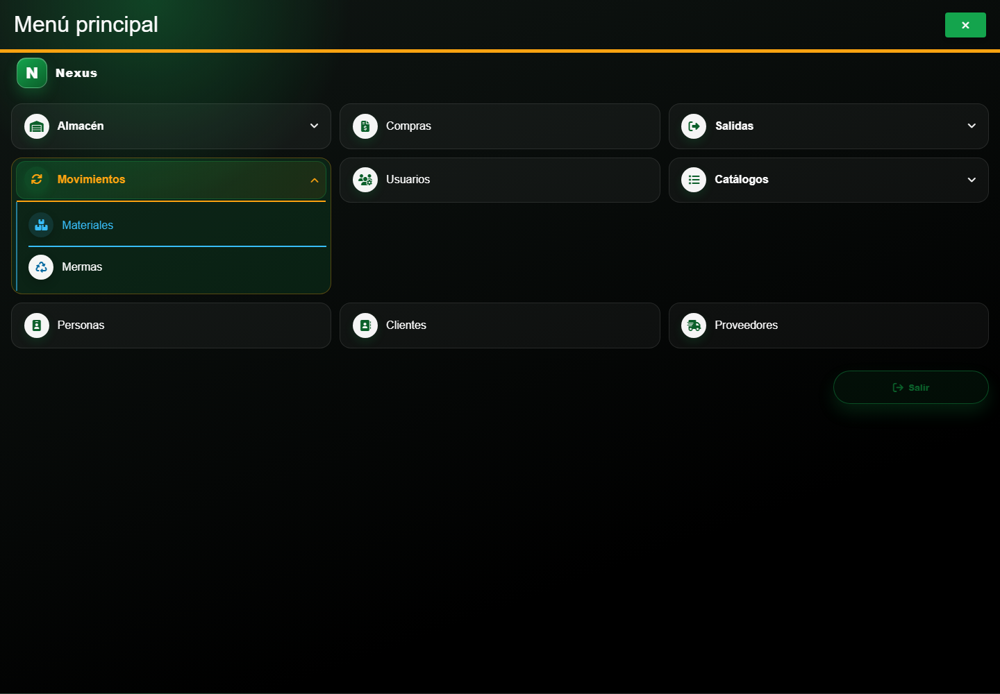
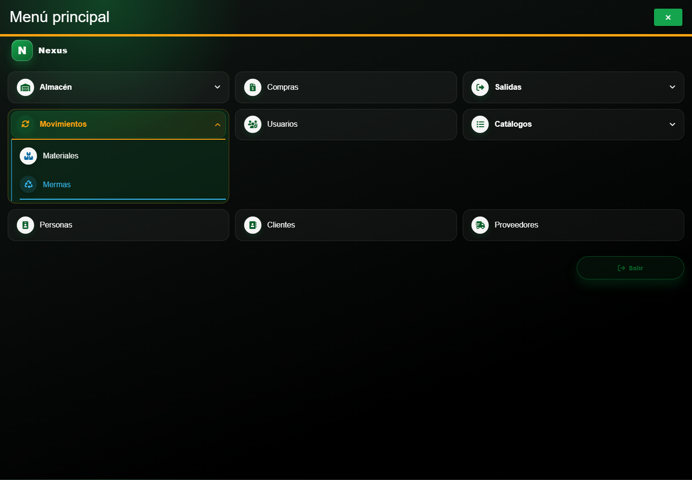

# Casos: Consultas y reportes

Cada procedimiento identifica sus casos de uso, controles, errores posibles y captura de referencia. Este módulo y sus dos accesos del menú son exclusivos del **Administrador del sistema** del área Sistemas; el Personal de almacén no puede consultar ni exportar movimientos actualmente.

## Capítulos

### Movimientos de material

**Propósito.** Consultar el historial, aplicar filtros y delimitar su reporte.

**Ruta en el menú:** **Menú principal → Movimientos → Materiales**.

1. [1. CAP-REP-MOV-MAT-01-LIST — Historial y filtros](01-cap-rep-mov-mat-01-list.md)
2. [2. CAP-REP-MOV-MAT-02-EXPORT — Exportar reporte](02-cap-rep-mov-mat-02-export.md)

### Movimientos de merma

**Propósito.** Consultar el historial, aplicar filtros y delimitar su reporte.

**Ruta en el menú:** **Menú principal → Movimientos → Mermas**.

3. [3. CAP-REP-MOV-WAS-01-LIST — Historial y filtros](03-cap-rep-mov-was-01-list.md)
4. [4. CAP-REP-MOV-WAS-02-EXPORT — Exportar reporte](04-cap-rep-mov-was-02-export.md)
