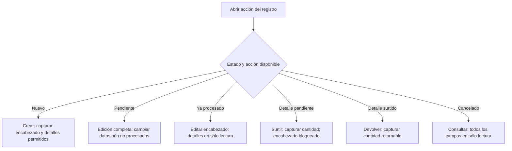

# Matriz de validación y modos de formulario

## Cómo leer esta matriz

Esta referencia reúne las validaciones que el operador puede comprobar en pantalla. No sustituye
las reglas del servidor ni convierte todos los formularios en un flujo idéntico. Consulte también
el [catálogo de mensajes](error-messages.md#errores-validacion) cuando Nexus rechace un dato.

Los avisos del manual usan una marca de color que también permanece visible al exportar a DOCX o
PDF:

- 🟨 **ADVERTENCIA:** una condición que debe comprobarse antes de continuar;
- 🟥 **DATO SENSIBLE:** información que no debe copiarse a capturas, archivos ni soporte;
- 🟦 **EXCEPCIÓN DEL PROCESO:** un comportamiento que aparece sólo en cierto módulo, estado o
  después de una acción.

## Matriz operativa

| Formulario o familia | Campos y controles que se validan | Cuándo se comprueba | Recuperación visible |
| --- | --- | --- | --- |
| Inicio de sesión | Usuario y contraseña requeridos; coincidencia con una cuenta habilitada | Al seleccionar **Iniciar sesión** | Corrija el campo indicado o solicite restablecimiento; no pruebe cuentas ajenas. |
| Personas, clientes y proveedores | Nombre e identificadores requeridos; formato y longitud; relaciones vigentes | En alta y edición | Conserve el formulario abierto y corrija sólo los campos marcados. |
| Usuarios y acceso | Persona, usuario, rol y departamento vigentes; usuario sin espacios; contraseña con longitud, mayúscula, número y carácter especial | En alta, edición de acceso o cambio de contraseña | No comparta la contraseña ni la incluya en evidencia; corrija la regla indicada. |
| Catálogos auxiliares | **Nombre** requerido y sin caracteres no admitidos; máximo 50 para Áreas, Roles, Presentaciones y Estados de cumplimiento, 20 para Unidades de medida y 100 para Motivos de ajuste; **Símbolo** requerido y máximo 10 sólo en Unidades de medida; **Activo** booleano requerido en todos los catálogos auxiliares | Al seleccionar **Guardar** o **Actualizar** | El formulario permanece abierto y señala el campo; una solicitud rechazada no modifica el catálogo. |
| Material / alta directa | Identidad, proveedor, unidad, presentación y dimensiones válidas; estado requerido; stock mínimo opcional numérico; existencia inicial y costo máximo obligatorios y numéricos | Al seleccionar **Guardar** desde **Almacén → Materiales** | Una identidad repetida no suma existencia: abra el registro vigente y use **Ajustar stock**. |
| Material / alta desde compra | Identidad, proveedor, unidad, presentación y dimensiones válidas; stock mínimo y estado admitidos. No se solicitan costo máximo, existencia inicial, razón ni observaciones de ajuste; costo máximo y existencia inicial dejan de ser obligatorios | Al seleccionar **Guardar** en **Nuevo material** abierto desde una compra | El material vuelve seleccionado con existencia cero y sin costo máximo; capture **Cantidad** y **Costo por Presentación** en el detalle y confirme la compra para afectar inventario. |
| Merma / alta directa | Nombre, proveedor, material de referencia, dimensiones positivas, estado, existencia inicial y costo máximo válidos; stock mínimo opcional numérico | Al seleccionar **Guardar** desde **Almacén → Mermas** | Una identidad repetida no suma existencia: abra el registro vigente y use **Ajustar stock**. |
| Material o merma / edición | Identidad y datos secundarios admitidos para el recurso; sólo se validan los campos habilitados y la existencia no cambia | Al seleccionar **Actualizar** | Conserve el formulario y corrija el campo señalado; use **Ajustar stock** para modificar la existencia. |
| Ajuste de existencia | El proveedor asociado se conserva automáticamente como contexto requerido; motivo vigente, nueva existencia numérica y observaciones admitidas | Al confirmar **Ajustar stock** | No seleccione otro proveedor: ajuste la oferta abierta desde el listado. La nueva cantidad es el total resultante, no una cantidad que se agrega. |
| Compra | Comprobante, factura cuando aplica, proveedor, receptor, fecha y al menos un detalle con material, cantidad y costo | En alta o actualización; la corrección valida además estado, motivo y límites | Una partida persistida se corrige con su acción especializada; no se sobrescribe como detalle nuevo. |
| Salida de material o merma | Participantes y relaciones vigentes, fecha, proyecto cuando aplica y al menos un detalle con cantidad positiva | En alta o edición permitida por el estado | Actualice el registro si cambió su estado y use solamente la acción que continúe visible. |
| Surtimiento | Detalle pendiente o parcial, cantidad positiva y existencia suficiente | Después de elegir **Surtir detalle** | Reduzca la cantidad o confirme disponibilidad; no modifique el encabezado desde este modo. |
| Devolución | Detalle surtido, cantidad positiva no mayor a la retornable y observaciones admitidas | Después de elegir **Devolver detalle** | Capture como máximo la cantidad retornable mostrada; los datos originales permanecen bloqueados. |
| Exportación | Alcance, filtros o periodo admitidos | Antes de generar el archivo | Conserve filtros; si la conexión falla, compruebe el listado antes de repetir. |

🟥 **DATO SENSIBLE:** usuario, contraseña, cookies, tokens, datos personales y registros reales no
deben aparecer en las capturas del manual. Use exclusivamente cuentas y datos ficticios.

## Modos de edición

El siguiente diagrama aclara por qué **editar** no siempre habilita los mismos campos. El estado
del registro y la acción elegida determinan el modo; el operador no selecciona el modo como un
campo adicional.

🟦 **EXCEPCIÓN DEL PROCESO:** en compras, un detalle ya persistido se modifica mediante
**Corregir detalle**; en salidas, un detalle procesado cambia mediante **Surtir** o **Devolver**.
Estas acciones conservan historia y efectos de inventario, por lo que no siguen la edición general.

## Conceptos necesarios para el manual

| Concepto | Significado para el operador |
| --- | --- |
| Modo de formulario | Configuración de controles habilitados según la acción y el estado; no es un estado guardado. |
| Encabezado | Datos contextuales del documento, como participantes, fecha, proyecto u observaciones. |
| Detalle | Renglón de material o merma con su cantidad y datos operativos. |
| Cantidad retornable | Parte surtida que todavía puede devolverse; limita el valor aceptado en una devolución. |
| Nueva existencia total | Resultado que debe quedar después de un ajuste; no representa un incremento. |
| Sólo lectura | Modo de consulta en el que la información se muestra pero no puede confirmarse como cambio. |

Los conceptos internos de DTO, router, transacción o permiso API permanecen en la documentación
técnica: no son necesarios para completar un formulario y por eso no se trasladan al manual.
